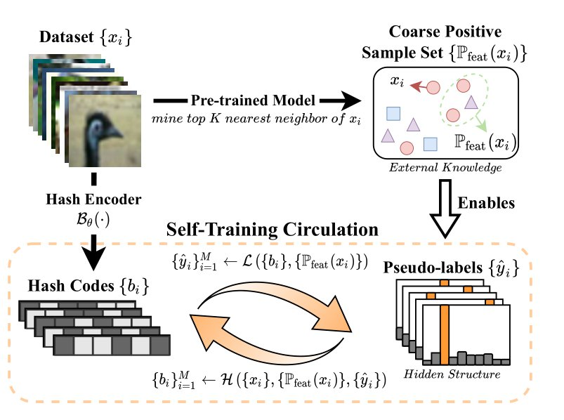
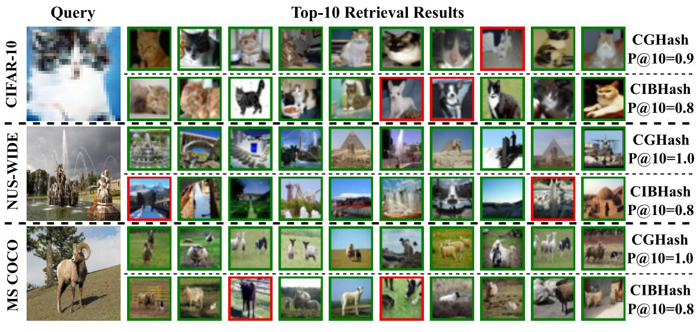

# CGHash: **C**onditional **G**enerative Model enhanced Contrastive Hashing

A pytorch implementation of our paper:

> Unsupervised Hashing with Contrastive Learning by Exploiting Similarity Knowledge and Hidden Structure of Data
>
> Accepted in Proceedings of the 31st ACM International Conference on Multimedia [ACM MM 2023].


## Training Schema




## Settings

1. Place downloaded datasets at `datasets/`. (Cifar-10 will be downloaded automatically.)
2. [Optional] Refer to `utils/data_path.py` to set dataset path.
3. Place pre-trained models at `models/pretrained_backbones/`. (A 300-epoch SimCLR pre-trained models for Cifar-10 is available.)
4. Configure training details in `configs/[dataset]/[stage]_[dataset]_[code_length].yml`.

## Training Example for 64-bit Cifar-10

1. Place `Cifar-10` dataset at `datasets/` manually or download automatically later.

2. Configure training details in `configs/cifar-10/mine_cifar10.yml`, `configs/cifar-10/cghash_cifar10_64.yml`, `configs/cifar-10/selflabel_cifar10_64.yml`.

3. Run shell training script.

   ```shell
   chmod +x ./run.sh
   ./run.sh [CODE_LENGTH] [GPU_ID]
   # e.g. ./run.sh 64 0,1
   ```

## Retrieval Example


